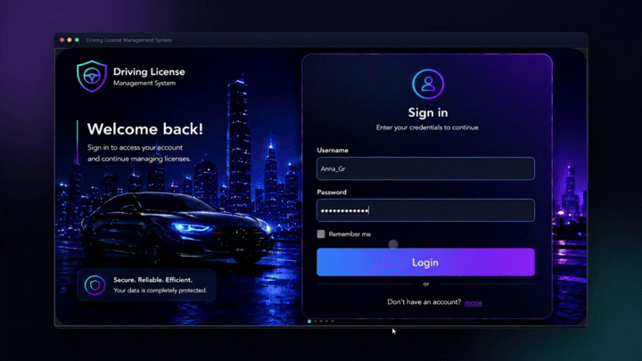

<div align="center">

# Driving License Management System (DVLD)

A full-featured desktop application for managing the complete lifecycle of driving licenses — applications, testing, issuance, renewals, and replacements — built with a clean layered architecture on .NET.



</div>

## Overview

DVLD is a production-style Windows desktop system that digitizes the driving license process end to end: applicant registration, vision/theory/practical exam scheduling, license issuance and printing, renewals, replacements (lost/damaged), international licenses, and administrative control over categories, pricing, and users.

The project was built to mirror how a real business application is structured — not a tutorial-style CRUD demo — with a proper data layer, business rules enforced at the database level, and a UI built for daily operational use.

## Features

- **Full license lifecycle** — new applications, renewals, lost/damaged replacements, license release, and international licenses
- **Exam management** — vision, theory, and practical tests with independent pricing and pass/fail tracking
- **Role-based access control** — separate permission levels for staff and administrators
- **Live dashboard** — real-time stats (total applications, issued licenses, pending applications, revenue) with chart-based license overview
- **Expiry tracking** — automatic surfacing of expired/soon-to-expire licenses with direct notification actions
- **Configurable service & category pricing** — vehicle categories (motorcycles, cars, trucks, buses, taxis, agricultural) each with their own minimum age, validity period, and price
- **Secure authentication** — Argon2id password hashing
- **Data integrity enforced in SQL** — triggers prevent invalid states (e.g. duplicate active licenses) at the database level, not just in application code

## Tech Stack

| Layer | Technology |
|---|---|
| UI | C# · WinForms · Guna UI 2 (custom dark theme) · LiveCharts |
| Business Logic | C# (BLL) |
| Data Access | ADO.NET (DAL) |
| Database | Microsoft SQL Server |
| Security | Argon2id password hashing |

## Architecture

The solution is split into three projects following a strict separation of concerns:

```
DVLD.sln
├── DVLD.DAL   → Data access: ADO.NET, one class per entity, GetXFromReader() helpers
├── DVLD.BLL   → Business rules, validation, orchestration
└── DVLD.UI    → WinForms presentation layer (Guna UI 2, LiveCharts)
```

- DAL methods return objects or `List<T>` directly rather than relying on `ref` parameters
- A shared `DAL.Shared` project centralizes the connection string across the solution
- Nullable foreign keys are handled explicitly with `(object)value ?? DBNull.Value`

### Database design

- Entity-relationship model designed with Crow's Foot notation, including junction tables and composite `UNIQUE` constraints
- `INSTEAD OF INSERT` triggers to prevent duplicate active licenses for the same person
- Read-optimized SQL **Views** backing the DAL's read operations
- ~14 functional modules covering applicants, drivers, licenses, exams, categories, pricing, and history

## Screens

The demo above walks through the sign-in screen, the live dashboard, license records (local and international), vehicle categories, and service/exam pricing management.

## Getting Started

1. Run `script.sql` on your SQL Server instance to create the database, schema, and sample data
2. Copy the `PersonPhotos` folder into the build output directory (next to the compiled `.exe`) so person photos resolve correctly
3. Update the connection string in `DAL.Shared`
4. Build and run `Drive_License_System_UI` in Visual Studio

## Author

**Meriouma Abdelhak**
Windows desktop application developer — C# · .NET · SQL Server

## License

This project is available under the MIT License.
